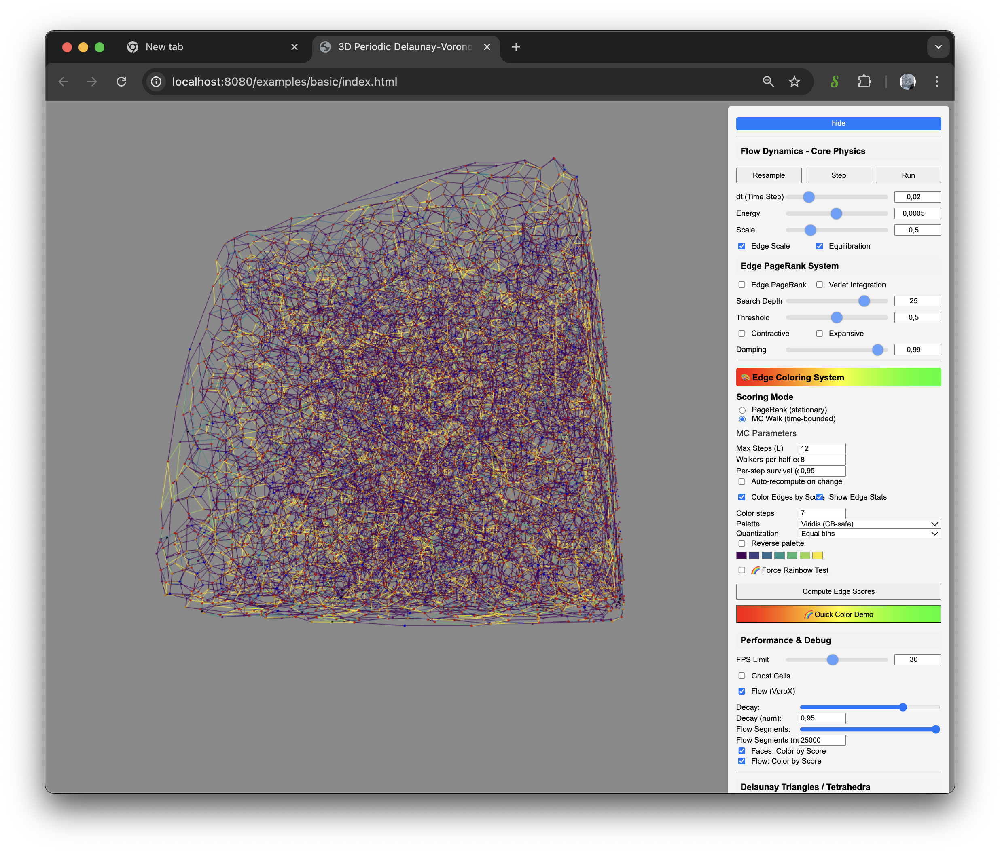
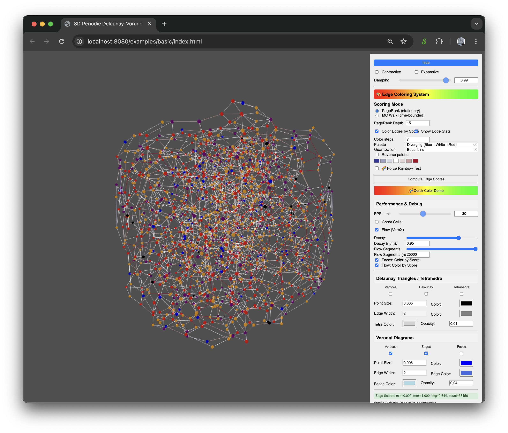

# Geogram-VoroX-Three.js

[Live Demo](https://virtualorganics.github.io/Geogram-VoroX-Three.js/)

A WebAssembly-powered 3D periodic Delaunay-Voronoi triangulation library for the browser, combining the computational power of [Geogram](https://github.com/BrunoLevy/geogram) with the visualization capabilities of [Three.js](https://github.com/mrdoob/three.js). This variant adds a VoroX-inspired circumcenter-based Voronoi construction alongside the existing barycenter method.

<p align="center">
  
   
</p>

## Features

- **3D Delaunay Triangulation**: Compute Delaunay tetrahedralization of 3D point sets
- **3D Voronoi Diagrams**: Generate Voronoi edges from Delaunay triangulation using either the barycenter or circumcenter method
- **Periodic Boundary Conditions**: Support for periodic (toroidal) domains
- **WebAssembly Performance**: Native-speed computation in the browser
- **Three.js Visualization**: Interactive 3D rendering with orbit controls
- **Clean JavaScript API**: Simple, promise-based interface hiding WASM complexity
- **VoroX Flow (experimental)**: Visualize active facet flow derived from the Delaunay/Voronoi structure

## Edge Scoring and Coloring

The app can color Voronoi edges and the VoroX flow network based on per‑edge scores.

### Scoring Modes

You can choose between two complementary scoring methods:

1. PageRank (stationary)
   - Global importance via a stationary distribution on the obtuse‑angle edge graph
   - Parameter: Depth = number of iterations (typ. 10–30)
   - Suited for capturing broad, global connectivity trends

2. MC Walk (time‑bounded)
   - Local openness measured by short, directional random walks that only pass obtuse “gates”
   - Parameters: L (steps), K (walkers per half‑edge), α (per‑step survival/discount)
   - Directional: scores are computed on both half‑edge starts and combined (min) to penalize one‑sided openness
   - Deterministic: each walker is seeded from (edgeKey, walkerId); same inputs → same results

Both methods normalize edge scores to [0, 1]. The same score map is used by both the Voronoi edges and the VoroX flow lines when their respective “Color by Score” toggles are enabled.

### Controls

In “Edge Coloring System”:

- Scoring Mode
  - PageRank (stationary): uses PR depth
  - MC Walk (time‑bounded): uses L, K, α
  - Toggle modes without recomputing; click “Compute Edge Scores” to generate colors

- MC Parameters
  - Max Steps (L): horizon; larger explores farther but costs more
  - Walkers per half‑edge (K): higher smooths noise but costs more
  - Per‑step survival (α): lower emphasizes near‑field; higher retains far mass

- PageRank Depth
  - Iterations for stationary propagation (typ. 15–25)

- Color Edges by Score
  - Applies the current score map to Voronoi edges; missing keys fall back to the edge color picker

- Flow: Color by Score (under Performance & Debug)
  - Applies the same score map to the flow network; missing keys fall back to the edge color picker

### Performance & Determinism

- MC cost estimate: ~ E · 2 · K · L half‑edge transitions. Reduce K or L for large meshes.
- Debouncing: enabling auto‑recompute debounces param changes to keep the UI responsive.
- Deterministic MC: walkers use a fixed PRNG seeded from edgeKey and walkerId.

### Troubleshooting

- Colors look uniform
  - PR: increase Depth
  - MC: increase L or decrease α
  - Consider using fewer or more irregular points

- Missing edges (fallback color used often)
  - Increase “Flow Segments (num)”
  - Ensure obtuse connectivity exists; adjust geometry or parameters (L/α)

- Slow recompute
  - Reduce K or L (MC) or Depth (PR)
  - Disable auto‑recompute during heavy edits

## Demo

[Live Demo](https://virtualorganics.github.io/Geogram-VoroX-Three.js/)

## What's New (XPBD Edge Mode)

- Worker-first Brain: edge scoring (PR/MC) runs off the main thread; UI stays responsive. The Brain slot posts/returns via a worker and the Physical phase runs between Brain slots.
- XPBD Physical phase (edge mode): per-face area constraints using percentage targets p each step.
  - p = g · sign(s−t) · |s−t|^γ, clamped to ±Max face scale/step
  - Controls: Strength g (default 0.001), Shaping γ (default 1.0), Inverse, Max face scale/step, Retriangulate every
  - Contractive/Expansive gate the sign; Equilibration can be used separately or turned off
- Topology-change priming: after retriangulation the system skips one XPBD frame, primes dual caches on the next Brain slot, and forces a Brain recompute for the new foamHash.
- Verlet/Euler are used only for the legacy gradient path; hidden/ignored under XPBD edge mode.

## VoroX Dynamics Controls: The Brain of the Simulation

The "Flow Dynamics" section provides detailed control over the simulation's physics and appearance. These controls are the "brain" of the program, allowing you to guide a self-organizing system of points as it seeks a state of equilibrium. The simulation's goal is to arrange the points into a stable, balanced structure, much like bubbles in a foam. The controls let you define the "laws of physics" for this system.

### Core Physics Parameters

*   **Decay**: This slider controls the "friction" or energy dissipation in the system. A value of `1.0` means no friction, which allows energy to build up indefinitely and can lead to explosive instability. Lower values (e.g., `0.95`) act like a drag force, causing the accumulated flow energy to fade each frame. This is crucial for allowing the system to shed energy and settle into a stable, dynamic equilibrium.
*   **dt**: Represents the "delta time" or the size of the integration step for each frame of the simulation. Conceptually, it's how far into the future the simulation jumps in each step. Higher values lead to faster evolution but increase the risk of "overshooting" a stable state and becoming numerically unstable.
*   **Energy**: A global multiplier for the strength of all calculated forces. You can think of this as the "temperature" or "kinetic energy" of the system. Higher values produce more dramatic and rapid movement, while lower values result in a more gentle relaxation.
*   **Scale**: This is the target or "ideal" distance that the simulation tries to establish between connected points. This parameter is central to the concept of homothety in the VoroX model, where each tetrahedron attempts to expand or contract to bring its edges to this ideal length, driving the self-organization of the entire structure.

### Force Model Toggles

These toggles control which components of the VoroX force model are active. The forces are always calculated using stable **barycenters** to prevent crashes, even though the flow visualization may use circumcenters.

*   **Edge Scale**: When checked, forces are calculated between every pair of points within a tetrahedron (an edge-based model), akin to a spring network. When unchecked, forces are calculated between each point and the tetrahedron's stable center (a center-based model). The edge-based model is more computationally intensive and typically results in a more energetic, "tense" equilibrium.
*   **Equilibration**: Toggles the main homothety force that pushes and pulls points to achieve the ideal `Scale` distance. This is the primary driver of organization in the simulation.
*   **Contractive**: Toggles a secondary, asymmetric force that gently pulls points together. Its strength is weighted by the "catchment" area of the flow knots, meaning it has a greater effect on points that are part of larger flow structures.
*   **Expansive**: Toggles a secondary, asymmetric force that gently pushes points apart, also weighted by the knot catchment area. Using `Contractive` and `Expansive` allows for fine-tuning the clustering or dispersion behavior of the system.

### Visualization Controls

These are your instruments for observing the invisible structures that emerge from the simulation's rules.

*   **Max Segs**: A performance control that limits the maximum number of flow edges drawn to the screen, preventing the display from becoming cluttered or slow.
*   **Flow**: Toggles the visibility of the VoroX flow edges, which represent the direction of "pressure" or "tension" in the geometric structure.
*   **Knots**: Toggles the visibility of detected cycles (knots) in the flow. When active, knot edges are highlighted with thicker, black strokes.
*   **Ghost Cells**: In periodic mode, this toggles the visibility of the 26 neighboring "ghost" cells, helping to visualize the toroidal, wrapped nature of the space.
*   **Color by Knot**: When checked, flow edges belonging to a knot are colored with a unique hue for each distinct knot. When unchecked, all flow edges are colored by their accumulated energy (from blue for low energy to red for high energy), providing a visual representation of the energy distribution and dissipation in the system.

## Quick Start
### Two-phase loop (Brain → Physical×N)
- Brain (PR/MC) computes edge scores and updates the legend; now optionally offloaded to a Web Worker for smoother UI.
- Physical runs XPBD per-face constraints for N steps using the last Brain scores. Controls: physPerBrain, xpbdMaxScale, Strength g, Shaping γ, Inverse, Retriangulate every.
- After retriangulation, XPBD pauses for one frame; caches are primed on the next Brain slot, then normal cadence resumes.

### Worker offload (experimental)
- The Brain step (adjacency + PR/MC) can run in `src/js/workers/brain.worker.js`.
- The page sends typed array data for centers, voronoiEdges and facetPairs; the worker returns score arrays and basic statistics.


### Using the Library

```javascript
import { DelaunayComputation } from './src/js/DelaunayComputation.js';

// Initialize the WASM module
const Module = await window.PeriodicDelaunayModule();

// Create points (array of [x, y, z] coordinates in range [0, 1])
const points = [
    [0.1, 0.2, 0.3],
    [0.4, 0.5, 0.6],
    // ... more points
];

// Create computation instance
// third parameter selects Voronoi construction method: 'barycenter' (default) or 'circumcenter'
const computation = new DelaunayComputation(points, true, 'circumcenter');

// Run the computation
await computation.compute(Module);

// Access results
console.log(`Computed ${computation.tetrahedra.length} tetrahedra`);
console.log(`Generated ${computation.voronoiEdges.length} Voronoi edges`);

// Tetrahedra: array of [v0, v1, v2, v3] vertex indices
// Voronoi edges: array of {start: [x,y,z], end: [x,y,z], isPeriodic: boolean}
```

### Visualization Example

```javascript
// Draw Delaunay edges
for (const tet of computation.tetrahedra) {
    // Extract and draw edges from tetrahedron
}

// Draw Voronoi diagram
for (const edge of computation.voronoiEdges) {
    const geometry = new THREE.BufferGeometry();
    const positions = new Float32Array([
        edge.start[0], edge.start[1], edge.start[2],
        edge.end[0], edge.end[1], edge.end[2]
    ]);
    geometry.setAttribute('position', new THREE.BufferAttribute(positions, 3));
    
    const material = edge.isPeriodic ? 
        new THREE.LineBasicMaterial({ color: 0xffaa00 }) : 
        new THREE.LineBasicMaterial({ color: 0xff6600 });
    
    const line = new THREE.Line(geometry, material);
    scene.add(line);
}
```

## API Reference

### DelaunayComputation Class

#### Constructor
```javascript
new DelaunayComputation(points, isPeriodic = true, voronoiMethod = 'barycenter')
```
- `points`: Array of 3D points as `[[x,y,z], ...]` or flat array `[x,y,z,x,y,z,...]`
- `isPeriodic`: Boolean, whether to use periodic boundary conditions
- `voronoiMethod`: `'barycenter' | 'circumcenter'` Voronoi construction

#### Methods
```javascript
async compute(wasmModule)
```
Runs the Delaunay-Voronoi computation. Returns the instance for chaining.

```javascript
getStats()
```
Returns an object with computation statistics:
```javascript
{
    numPoints: number,
    numTetrahedra: number,
    numVoronoiEdges: number,
    isPeriodic: boolean
}
```

```javascript
getPeriodicDistance(p1, p2)
```
Calculates the minimum image distance between two points in periodic space.

#### Properties
- `pointsArray`: Array of input points as `[[x,y,z], ...]`
- `tetrahedra`: Array of tetrahedra as `[[v0,v1,v2,v3], ...]`
- `voronoiEdges`: Array of Voronoi edges as `[{start, end, tetraIndices, isPeriodic}, ...]`
- `barycenters`: Array of tetrahedra barycenters as `[[x,y,z], ...]`

## Building from Source

### Prerequisites
- Emscripten SDK
- Node.js
- C++17 compiler

### Build Steps
```bash
# Clone the repository
git clone https://github.com/VirtualOrganics/Geogram-VoroX-Three.js.git
cd Geogram-VoroX-Three.js

# Build the WASM module
cd src/cpp
./build.sh

# The compiled files will be in dist/
```

## Implementation Details

### Voronoi Computation
Two methods are available:
1. Barycenter method (default): compute tetra centroids and connect centroids of adjacent tets.
2. Circumcenter method (VoroX-inspired): compute tetra circumcenters with a numerical safeguard (fallback to centroid on near-degeneracy), then connect circumcenters of adjacent tets. Periodic handling adjusts vertices to a consistent image prior to computing centers, then wraps back to the unit cube.

### Periodic Boundaries
When periodic mode is enabled:
- Points are assumed to be in the unit cube [0, 1]³
- The space wraps around at the boundaries (toroidal topology)
- Edges crossing boundaries are marked with `isPeriodic: true`

## Controls Guide

### Main Controls
- **Points**: The number of random points to generate.
- **Min Dist**: The minimum distance between generated points.
- **Motion**: The randomness of the point movement. Higher values result in more erratic paths.
- **Speed**: The speed at which the points travel.
- **Live Update**: When checked, the triangulation and Voronoi diagrams continuously update to reflect point motion.
- **Update Step**: Sets the number of frames to wait before each live update. Higher values are less intensive.
- **Periodic**: Toggles periodic boundary conditions, making the space wrap around like a torus.
- **Ghost Cells**: Displays the 26 neighboring "ghost" cells in periodic mode to visualize the toroidal space.
- **Background**: The background color of the scene.
- **Poisson**: Toggles Poisson disk sampling for point generation, which creates more evenly spaced points.
- **MIC**: Toggles the "Minimum Image Convention" visualization mode, which enables thick, adjustable edges.
- **Boundary**: Toggles the visibility of the boundary box.

### Delaunay Triangles / Tetrahedra
- **Vertices**: Toggles the visibility of the Delaunay vertices (the input points).
- **Delaunay**: Toggles the visibility of the Delaunay edges.
- **Tetrahedra**: Toggles the visibility of the Delaunay tetrahedra (the 3D cells).

### Voronoi Diagrams
- **Voronoi**: Toggles the visibility of the Voronoi edges.
- **Faces**: Toggles the visibility of the Voronoi cell faces.
- **Random Colors**: Toggles random coloring for the Voronoi faces.

## License

This project is licensed under the MIT License. See the LICENSE file for details.

## Acknowledgments

- [Geogram](https://github.com/BrunoLevy/geogram) by Bruno Levy for the computational geometry algorithms
- [Three.js](https://github.com/mrdoob/three.js) for 3D visualization
- [Emscripten](https://emscripten.org/) for WebAssembly compilation
 - VoroX.jl for algorithmic inspiration and reference implementation of circumcenter and adjacency flow: see `center.jl`, `foam.jl`, and `periodic.jl` in the pinned commit [a0fd54b](https://github.com/blegat/VoroX.jl/tree/a0fd54b2ea4277da4c5fe5b41a28a761d2c652ec)
