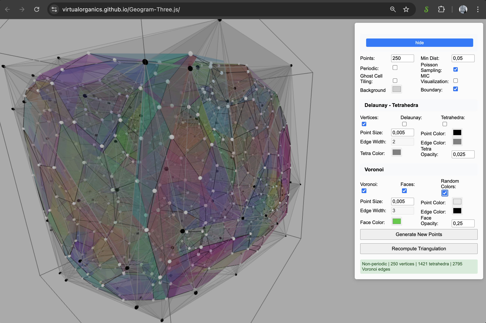
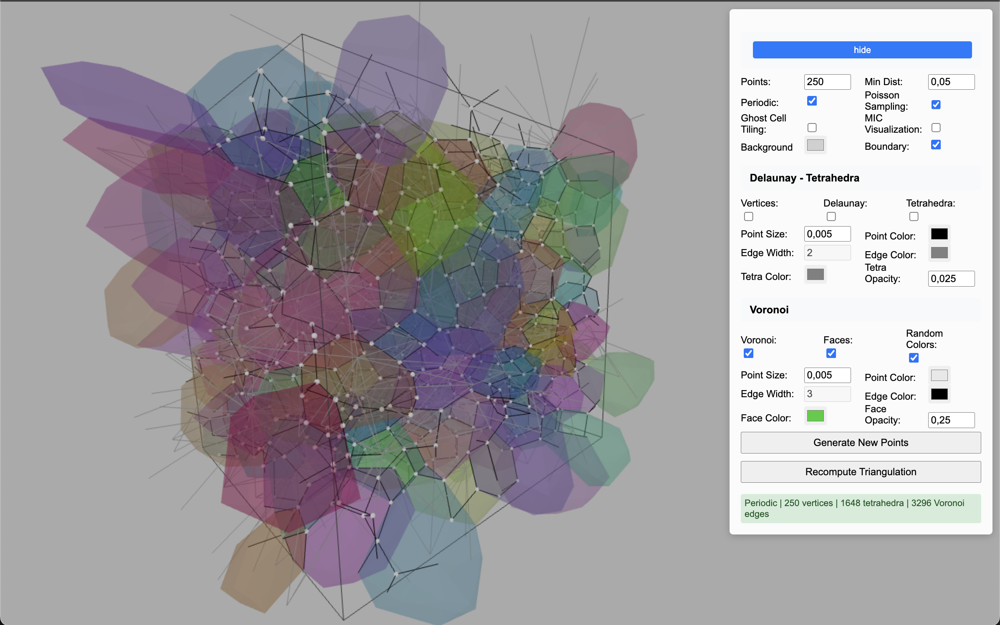

# Geogram-VoroX-Three.js

[Live Demo](https://virtualorganics.github.io/Geogram-Three.js/)

A WebAssembly-powered 3D periodic Delaunay-Voronoi triangulation library for the browser, combining the computational power of [Geogram](https://github.com/BrunoLevy/geogram) with the visualization capabilities of [Three.js](https://github.com/mrdoob/three.js). This variant adds a VoroX-inspired circumcenter-based Voronoi construction alongside the existing barycenter method.

<p align="center">
  
   
</p>
<p align="center">
  
  
</p>

## Features

- **3D Delaunay Triangulation**: Compute Delaunay tetrahedralization of 3D point sets
- **3D Voronoi Diagrams**: Generate Voronoi edges from Delaunay triangulation using either the barycenter or circumcenter method
- **Periodic Boundary Conditions**: Support for periodic (toroidal) domains
- **WebAssembly Performance**: Native-speed computation in the browser
- **Three.js Visualization**: Interactive 3D rendering with orbit controls
- **Clean JavaScript API**: Simple, promise-based interface hiding WASM complexity

## Demo

[Live Demo](https://virtualorganics.github.io/Geogram-Three.js/)

## Quick Start

### Using the Library

```javascript
import { DelaunayComputation } from './src/js/DelaunayComputation.js';

// Initialize the WASM module
const Module = await window.PeriodicDelaunayModule();

// Create points (array of [x, y, z] coordinates in range [0, 1])
const points = [
    [0.1, 0.2, 0.3],
    [0.4, 0.5, 0.6],
    // ... more points
];

// Create computation instance
// third parameter selects Voronoi construction method: 'barycenter' (default) or 'circumcenter'
const computation = new DelaunayComputation(points, true, 'circumcenter');

// Run the computation
await computation.compute(Module);

// Access results
console.log(`Computed ${computation.tetrahedra.length} tetrahedra`);
console.log(`Generated ${computation.voronoiEdges.length} Voronoi edges`);

// Tetrahedra: array of [v0, v1, v2, v3] vertex indices
// Voronoi edges: array of {start: [x,y,z], end: [x,y,z], isPeriodic: boolean}
```

### Visualization Example

```javascript
// Draw Delaunay edges
for (const tet of computation.tetrahedra) {
    // Extract and draw edges from tetrahedron
}

// Draw Voronoi diagram
for (const edge of computation.voronoiEdges) {
    const geometry = new THREE.BufferGeometry();
    const positions = new Float32Array([
        edge.start[0], edge.start[1], edge.start[2],
        edge.end[0], edge.end[1], edge.end[2]
    ]);
    geometry.setAttribute('position', new THREE.BufferAttribute(positions, 3));
    
    const material = edge.isPeriodic ? 
        new THREE.LineBasicMaterial({ color: 0xffaa00 }) : 
        new THREE.LineBasicMaterial({ color: 0xff6600 });
    
    const line = new THREE.Line(geometry, material);
    scene.add(line);
}
```

## API Reference

### DelaunayComputation Class

#### Constructor
```javascript
new DelaunayComputation(points, isPeriodic = true, voronoiMethod = 'barycenter')
```
- `points`: Array of 3D points as `[[x,y,z], ...]` or flat array `[x,y,z,x,y,z,...]`
- `isPeriodic`: Boolean, whether to use periodic boundary conditions
- `voronoiMethod`: `'barycenter' | 'circumcenter'` Voronoi construction

#### Methods
```javascript
async compute(wasmModule)
```
Runs the Delaunay-Voronoi computation. Returns the instance for chaining.

```javascript
getStats()
```
Returns an object with computation statistics:
```javascript
{
    numPoints: number,
    numTetrahedra: number,
    numVoronoiEdges: number,
    isPeriodic: boolean
}
```

```javascript
getPeriodicDistance(p1, p2)
```
Calculates the minimum image distance between two points in periodic space.

#### Properties
- `pointsArray`: Array of input points as `[[x,y,z], ...]`
- `tetrahedra`: Array of tetrahedra as `[[v0,v1,v2,v3], ...]`
- `voronoiEdges`: Array of Voronoi edges as `[{start, end, tetraIndices, isPeriodic}, ...]`
- `barycenters`: Array of tetrahedra barycenters as `[[x,y,z], ...]`

## Building from Source

### Prerequisites
- Emscripten SDK
- Node.js
- C++17 compiler

### Build Steps
```bash
# Clone the repository
git clone https://github.com/VirtualOrganics/Geogram-Three.js.git
cd Geogram-Three.js

# Build the WASM module
cd src/cpp
./build.sh

# The compiled files will be in dist/
```

## Implementation Details

### Voronoi Computation
Two methods are available:
1. Barycenter method (default): compute tetra centroids and connect centroids of adjacent tets.
2. Circumcenter method (VoroX-inspired): compute tetra circumcenters with a numerical safeguard (fallback to centroid on near-degeneracy), then connect circumcenters of adjacent tets. Periodic handling adjusts vertices to a consistent image prior to computing centers, then wraps back to the unit cube.

### Periodic Boundaries
When periodic mode is enabled:
- Points are assumed to be in the unit cube [0, 1]³
- The space wraps around at the boundaries (toroidal topology)
- Edges crossing boundaries are marked with `isPeriodic: true`

## Controls Guide

### Main Controls
- **Points**: The number of random points to generate.
- **Min Dist**: The minimum distance between generated points.
- **Motion**: The randomness of the point movement. Higher values result in more erratic paths.
- **Speed**: The speed at which the points travel.
- **Live Update**: When checked, the triangulation and Voronoi diagrams continuously update to reflect point motion.
- **Update Step**: Sets the number of frames to wait before each live update. Higher values are less intensive.
- **Periodic**: Toggles periodic boundary conditions, making the space wrap around like a torus.
- **Ghost Cells**: Displays the 26 neighboring "ghost" cells in periodic mode to visualize the toroidal space.
- **Background**: The background color of the scene.
- **Poisson**: Toggles Poisson disk sampling for point generation, which creates more evenly spaced points.
- **MIC**: Toggles the "Minimum Image Convention" visualization mode, which enables thick, adjustable edges.
- **Boundary**: Toggles the visibility of the boundary box.

### Delaunay Triangles / Tetrahedra
- **Vertices**: Toggles the visibility of the Delaunay vertices (the input points).
- **Delaunay**: Toggles the visibility of the Delaunay edges.
- **Tetrahedra**: Toggles the visibility of the Delaunay tetrahedra (the 3D cells).

### Voronoi Diagrams
- **Voronoi**: Toggles the visibility of the Voronoi edges.
- **Faces**: Toggles the visibility of the Voronoi cell faces.
- **Random Colors**: Toggles random coloring for the Voronoi faces.

## License

This project is licensed under the MIT License. See the LICENSE file for details.

## Acknowledgments

- [Geogram](https://github.com/BrunoLevy/geogram) by Bruno Levy for the computational geometry algorithms
- [Three.js](https://github.com/mrdoob/three.js) for 3D visualization
- [Emscripten](https://emscripten.org/) for WebAssembly compilation
 - VoroX.jl for algorithmic inspiration and reference implementation of circumcenter and adjacency flow: see `center.jl`, `foam.jl`, and `periodic.jl` in the pinned commit [a0fd54b](https://github.com/blegat/VoroX.jl/tree/a0fd54b2ea4277da4c5fe5b41a28a761d2c652ec)
